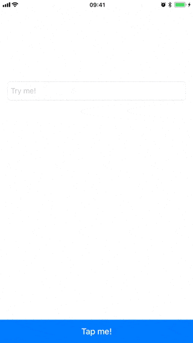
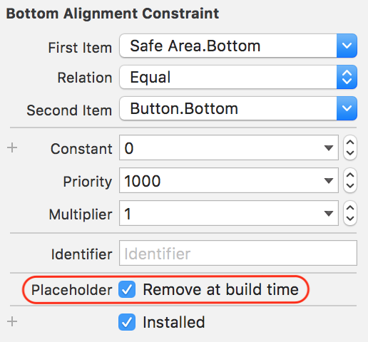

# ⌨️ KeyboardLayoutGuide
*Apple's missing KeyboardLayoutGuide*

[](https://developer.apple.com/swift)

[](https://swift.org/package-manager/)
[](https://github.com/Carthage/Carthage)
[](https://cocoapods.org/pods/Keyboard+LayoutGuide)
[](https://app.bitrise.io/app/0c1de450af273bff)
[](https://codebeat.co/projects/github-com-freshos-keyboardlayoutguide-master)
[](https://github.com/s4cha/Stevia/blob/master/LICENSE)
[](https://github.com/freshOS/KeyboardLayoutGuide/releases)


- [x] No Subclassing / Protocol inheritance / obscure overrides
- [x] No more keyboard notification handling
- [x] `UIKit` Friendly
- [x] Takes `safeArea` into account
- [x] Only animates if view is fully on screen



## How to use it

Simply constrain your views to the KeyboardLayoutGuide's top anchor the way you would do natively:


```swift
override func viewDidLoad() {
    super.viewDidLoad()

    // Pin your button to the keyboard
    button.bottomAnchor.constraint(equalTo: view.keyboardLayoutGuide.topAnchor).isActive = true
}
```

**Bonus**: if you're using [Stevia](https://github.com/freshOS/Stevia), this gets even more concise \o/
```swift
button.Bottom == view.keyboardLayoutGuide.Top
```

If you add your view in Interface Builder, don't forget to enable the "**Remove at build time**" checkbox for the bottom constraint:



## Safe Area
By default, KeyboardLayoutGuide will align your item with the bottom safe area.
This is a behaviour that can be opt out by using `keyboardLayoutGuideNoSafeArea` instead of `keyboardLayoutGuide`.

## Installation

### CocoaPods

To install `KeyboardLayoutGuide` via [CocoaPods](http://cocoapods.org), add the following line to your Podfile:

```
target 'MyAppName' do
  pod 'Keyboard+LayoutGuide'
  use_frameworks!
end
```

### Carthage

To install `KeyboardLayoutGuide` via [Carthage](https://github.com/Carthage/Carthage#if-youre-building-for-ios-tvos-or-watchos), add the following line to your Cartfile:

```
github "freshos/KeyboardLayoutGuide"
```

### Swift Package Manager

To integrate `KeyboardLayoutGuide` via [SPM](https://swift.org/package-manager/) into your Xcode 11 project specify it in Project > Swift Packages:
```
https://github.com/freshOS/KeyboardLayoutGuide
```

### Manually
Just add `Keyboard+LayoutGuide.swift` to your Xcode project.

## License

`KeyboardLayoutGuide` is available under the MIT license. See the [LICENSE](LICENSE) file for more info.
